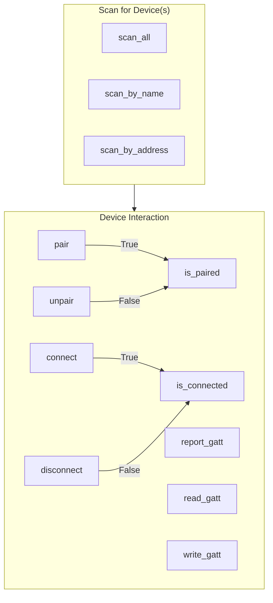
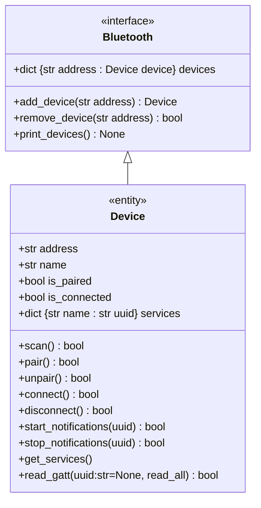
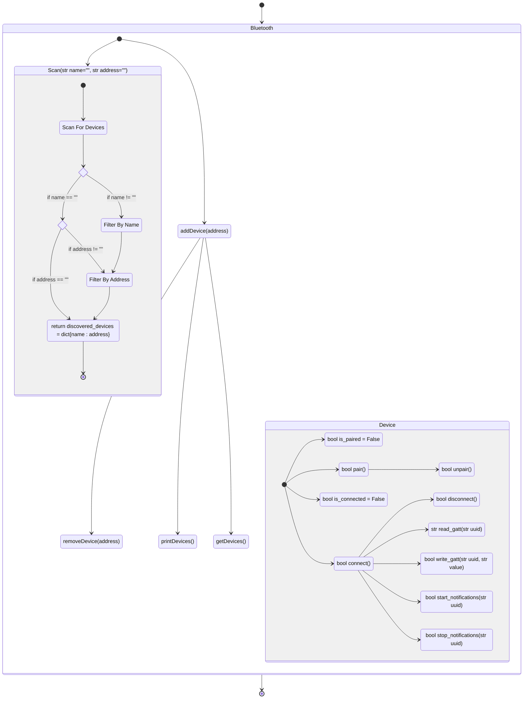

# High Level

```mermaid

flowchart TB
    subgraph scan_for_device["Scan for Device(s)"]
        scan_all
        scan_by_name
        scan_by_address
    end 
    scan_for_device --> device_interaction
    subgraph device_interaction["Device Interaction"]
        pair --> |"True"| is_paired
        unpair --> |"False"| is_paired
        connect --> |"True"| is_connected
        disconnect -->|"False"| is_connected
        report_gatt
        read_gatt
        write_gatt
    end
```

# Class Diagram

```mermaid
classDiagram
    class Bluetooth
        <<interface>> Bluetooth
        Bluetooth : +dict #123;str address #58; Device device#125; devices
        Bluetooth : +add_device(str address) Device
        Bluetooth : +remove_device(str address) bool
        Bluetooth : +print_devices() None
    
    Bluetooth <|-- Device

    class Device{
        <<entity>>
        +str address
        +str name
        +bool is_paired
        +bool is_connected
        +dict #123;str name #58; str uuid#125; services
        +scan() bool
        +pair() bool
        +unpair() bool
        +connect() bool
        +disconnect() bool
        +start_notifications(uuid) bool
        +stop_notifications(uuid) bool
        +get_services()
        +read_gatt(uuid:str=None, read_all) bool
      }
```

# State Diagram

```mermaid
stateDiagram-v2
    Communicator_Bluetooth : Bluetooth
    [*] --> Communicator_Bluetooth
    state Communicator_Bluetooth {
        direction TB
        Communicator_Bluetooth_Scan : Scan(str name="", str address="")
        [*] --> Communicator_Bluetooth_Scan
        state Communicator_Bluetooth_Scan {
            direction TB
            state Communicator_Bluetooth_Scan_if_name <<choice>>
            state Communicator_Bluetooth_Scan_if_address <<choice>>
            Communicator_Bluetooth_Scan_Scan : Scan For Devices
            Communicator_Bluetooth_Scan_FilterByName : Filter By Name
            Communicator_Bluetooth_Scan_FilterByAddress : Filter By Address
            Communicator_Bluetooth_Scan_Return : return discovered_devices = dict{name #58; address}
            [*] --> Communicator_Bluetooth_Scan_Scan
            Communicator_Bluetooth_Scan_Scan --> Communicator_Bluetooth_Scan_if_name
            Communicator_Bluetooth_Scan_if_name --> Communicator_Bluetooth_Scan_FilterByName : if name != ""
            Communicator_Bluetooth_Scan_if_name --> Communicator_Bluetooth_Scan_if_address : if name == ""
            Communicator_Bluetooth_Scan_if_address --> Communicator_Bluetooth_Scan_FilterByAddress : if address != ""
            Communicator_Bluetooth_Scan_if_address --> Communicator_Bluetooth_Scan_Return : if address == ""
            Communicator_Bluetooth_Scan_FilterByName --> Communicator_Bluetooth_Scan_FilterByAddress
            Communicator_Bluetooth_Scan_FilterByAddress --> Communicator_Bluetooth_Scan_Return
            Communicator_Bluetooth_Scan_Return --> [*]
        }
        [*] --> addDevice
        addDevice : addDevice(address)
        removeDevice : removeDevice(address)
        printDevices : printDevices()
        getDevices : getDevices()
        addDevice --> removeDevice
        addDevice --> printDevices
        addDevice --> getDevices
        state Device {
            direction LR
            Communicator_Bluetooth_Device_isPaired : bool is_paired = False
            Communicator_Bluetooth_Device_pair : bool pair()
            Communicator_Bluetooth_Device_unpair : bool unpair()
            Communicator_Bluetooth_Device_isConnected : bool is_connected = False
            Communicator_Bluetooth_Device_connect : bool connect()
            Communicator_Bluetooth_Device_disconnect : bool disconnect()
            Communicator_Bluetooth_Device_readGatt : str read_gatt(str uuid)
            Communicator_Bluetooth_Device_writeGatt : bool write_gatt(str uuid, str value)
            Communicator_Bluetooth_Device_startNotifications : bool start_notifications(str uuid)
            Communicator_Bluetooth_Device_stopNotifications : bool stop_notifications(str uuid)
            [*] --> Communicator_Bluetooth_Device_isPaired
            [*] --> Communicator_Bluetooth_Device_pair
            Communicator_Bluetooth_Device_pair --> Communicator_Bluetooth_Device_unpair
            [*] --> Communicator_Bluetooth_Device_isConnected
            [*] --> Communicator_Bluetooth_Device_connect
            Communicator_Bluetooth_Device_connect --> Communicator_Bluetooth_Device_disconnect
            Communicator_Bluetooth_Device_connect --> Communicator_Bluetooth_Device_readGatt
            Communicator_Bluetooth_Device_connect --> Communicator_Bluetooth_Device_writeGatt
            Communicator_Bluetooth_Device_connect --> Communicator_Bluetooth_Device_startNotifications
            Communicator_Bluetooth_Device_connect --> Communicator_Bluetooth_Device_stopNotifications
            
        }
    }
    Communicator_Bluetooth --> [*]
```

